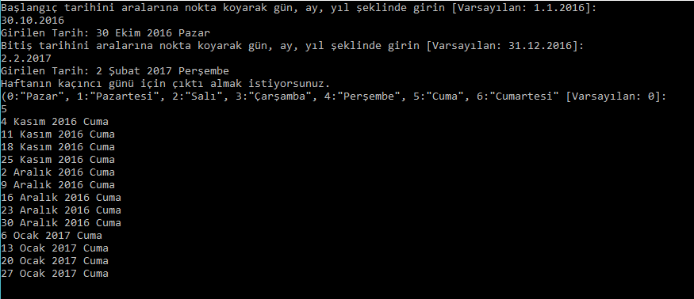

# C# Algoritma Örnekleri

C# ile çeşitli zorluklarda algoritmaları oluşturup, yazılımın matematik ile olan ilgisini inceleyeceğiz.

----------

 1. [Tarih Algoritması Örneği](Ornekler/Tarih/Program.cs)

## Tarih Algoritması Örneği ##

Verilen tarihler arasında, istenilen haftanın gününü listelememize yarayan bir örnek uygulama.  Verilen bir tarihin haftanın hangi günü olduğu, artık yılların ne zamanlar olduğunu, Milad'dan itibaren verilen tarihe kadar kaç gün olduğunu bulmak için algoritmalar üretip bizden istenilen tarihleri listeleyeceğiz.
